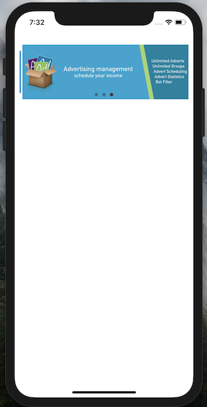

# Carousel-with-swift-4

This project shows you how to create a carousel using swift 4.

This carousel is done withouth using storyboard, it's all by code.
* Has a page control
* Change page automatically every certain time.

hope you find it helpful.

